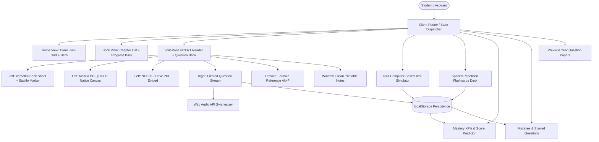

# PrepClone — Technical Architecture Documentation

## 1. System Overview

PrepClone is engineered as a single-page application (SPA) adhering to **Offline-First**, **Zero-Backend**, and **Local-First** paradigms. It runs entirely inside modern web standards: ES6+, CSS3 Custom Properties, Web Audio API, Canvas 2D, Service Workers, Cache Storage API, and Web Storage.



---

## 2. File Structure

```
preppage-clone/
├── index.html              # Entire SPA (~6,000 lines): router, views, all JS logic
├── styles.css              # All CSS: themes, animations, print, responsive (64 KB)
├── sw.js                   # Service Worker (prepclone-v2.1.0): offline precache
├── manifest.json           # PWA manifest: icons, theme, display mode
├── host.sh                 # Dev tool: local HTTP server + Cloudflare tunnel
├── data/                   # 10 × book JSON + PYQ bank + formulas (17 MB total)
├── books/                  # 79 × official NCERT chapter PDFs (350 MB total)
├── vendor/pdfjs/           # Mozilla PDF.js v3.11.174 bundled (offline)
└── images/                 # SVG PWA icons (192px, 512px)
```

---

## 3. Navigation & State Model

Hash-free routing via `navigate(page, args)` and `currentPage` variable:

| Route | View | Key Args |
|---|---|---|
| `home` | Curriculum overview grid | — |
| `books` | Filterable book grid | — |
| `book` | Chapter list + progress | `bookId` |
| `chapter` | Split-pane reader + questions | `bookId`, `chapterIdx`, `pageNum` |
| `mix-quiz` | NTA CBT exam simulator | — |
| `quiz` | Quick 10-question drill | — |
| `flashcards` | SM-2 active recall deck | — |
| `analytics` | Performance dashboard | — |
| `notebook` | Mistakes & starred | — |
| `pyqs` | PYQ hub & paper links | — |

---

## 4. Data Schema

### Book Page Object (`data/*.json` — array of page objects)
```typescript
interface NcertPage {
  book_id?: string;        // e.g. "biology-11" (some books omit — inferred)
  chapter: number;         // 0-indexed chapter number
  page: number;            // 1-indexed page number within chapter
  topic: string;           // Section heading / topic name
  paragraphs: Array<{
    id: string;            // "${bookId}_${chapter}_${page}_${idx}"
    text: string;          // Verbatim NCERT paragraph text
    keyTerm?: string;      // Primary scientific term for Cloze blanks
  }>;
  questions: Array<{
    question: string;      // Question text
    options: string[];     // 4 answer choices (A, B, C, D)
    answer: 'A'|'B'|'C'|'D';
    difficulty?: string;   // 'Easy' | 'Medium' | 'Hard'
    type?: string;         // 'AR' | 'ST' | 'MC' | 'standard'
    exam?: string;         // 'NEET' | 'JEE' | 'JEE+NEET'
    hint?: string;         // Short hint for the student
    explanation?: string;  // Detailed NCERT conceptual explanation
    ncertRef?: string;     // Paragraph/page reference string
    ncertPara?: string;    // Verbatim anchor sentence from textbook
    pyq?: boolean;         // true if this is a real past-year question
    year?: string;         // e.g. "NEET 2023"
    source?: string;       // Source URL for PYQ
    sourceName?: string;   // Source site name
  }>;
}
```

### PYQ Object (`data/pyq.json` — array)
```typescript
interface PYQ {
  book: string;            // Book ID (e.g. "chemistry-12-part-1")
  chapter: number;         // 0-indexed chapter
  question: string;
  options: string[];
  answer: 'A'|'B'|'C'|'D';
  difficulty: string;
  exam: string[];          // e.g. ["NEET"] or ["JEE"]
  year: string;            // e.g. "AIEEE 2004"
  explanation: string;
  hint: string;
  source: string;          // URL of origin
  sourceName: string;      // e.g. "BYJU'S"
  ncertRef: string;        // NCERT section/page reference
  ncertPara: string;       // Verbatim NCERT anchor
}
```

---

## 5. localStorage Persistence Schemas

### `prepclone-progress` — Practice history
```typescript
// Key: "${bookId}_${chapterIndex}_${pageNumber}_${questionIndex}"
interface ProgressEntry {
  picked: number;      // Selected option index (0 = A)
  correct: boolean;
  timestamp: number;   // ms epoch
}
```

### `prepclone-mistakes` — Incorrect answer vault
```typescript
interface MistakeRecord {
  id: string;          // Same key as progress
  question: string;
  options: string[];
  answer: string;      // 'A'|'B'|'C'|'D'
  picked: number;
  explanation: string;
  ncertRef: string;
  book: string;
  chapter: number;
  page: number;
  timestamp: number;
  bucket?: string;     // 'silly'|'conceptual'|'formula'|'guess'
}
```

### `prepclone-starred` — Bookmarks
```typescript
type StarredStore = string[];  // Array of question IDs
```

### `prepclone-cbt-history` — CBT exam sessions
```typescript
interface CbtSession {
  date: string;        // ISO date
  preset: string;      // 'neet-full' | 'physics-drill' | etc.
  title: string;
  score: number;
  totalMarks: number;
  percentage: number;
  timeSpentSecs: number;
  sectionScores: Record<string, {
    attempted: number; correct: number; incorrect: number; score: number;
  }>;
}
```

### `prepclone-flashcards` — SM-2 states
```typescript
interface FlashcardState {
  repetitions: number;   // Consecutive successful recalls
  interval: number;      // Days until next review
  easeFactor: number;    // Difficulty multiplier (default 2.5)
  dueDate: number;       // Timestamp when card is due
}
// Keyed by card ID string
```

### `prepclone-notes` — Personal NCERT margin annotations
```typescript
interface NoteRecord {
  id: string;            // "${bookId}_${chapterIdx}_${page}_${qidx}"
  content: string;       // User handwritten-style study note
  bookId: string;
  bookTitle: string;
  chapterIdx: number;
  chapterTitle: string;
  pageNum: number;
  paraNum: number;
  paraSnippet: string;   // Verbatim excerpt of annotated paragraph
  updatedAt: number;     // ms epoch
}
type NotesStore = Record<string, NoteRecord>;
```

### `prepclone-daily-goal` — Daily study target
```typescript
interface DailyGoalRecord {
  target: number;        // 20 | 50 | 100 Qs
  count: number;         // Questions answered today
  date: string;          // e.g. "Thu Sep 10 2026"
}
```

### `prepclone-snapshots` — Local backup vault
```typescript
interface LocalSnapshot {
  timestamp: number;
  progressCount: number;
  mistakesCount: number;
  notesCount: number;
  data: {
    progress: string[];
    mistakes: Record<string, MistakeRecord>;
    starred: string[];
    notes: NotesStore;
    cbtHistory: CbtSession[];
  };
}
type SnapshotVault = LocalSnapshot[]; // Last 5 rotating snapshots
```

### User Preference Keys
- `theme`: `'dark'` | `'light'` | `'oled'` | `'sepia'`
- `prepclone-sound`: `'on'` | `'off'`
- `prepclone-leftpane-mode`: `'reader'` | `'canvas'` | `'pdf'`
- `prepclone-pdfmode`: `'0'` (Drive) | `'1'` (NCERT) | `'2'` (Google Viewer)

---

## 6. Sentence-Level Golden Marker Pen Algorithm

When `highlightHint(bookId, chIdx, page, qIdx)` is called:

1. **Target Identification**: Resolves `.ncert-para` by ID `${bookId}_${chIdx}_${page}_${qIdx}`.
2. **Text Cache**: Preserves `element.dataset.origText` to prevent markup accumulation on multiple hints.
3. **Sentence Extraction**: Splits paragraph via `/[^.!?]+(?:[.!?]+["']?|$)/g`.
4. **Relevance Scoring**:
   $$\text{Score}(S) = 20 \cdot \mathbf{1}[\text{optionFragment} \in S] + 5\sum_{w \in W_{\text{ans}}} \mathbf{1}[w \in S] + 2\sum_{w \in W_{\text{q}}} \mathbf{1}[w \in S] + \sum_{w \in W_{\text{exp}}} \mathbf{1}[w \in S]$$
   Stop words stripped, words lowercased and compared.
5. **DOM Injection**: `<mark class="ncert-sentence-marker sweep"><span class="marker-pen-icon">🖊️</span>${sentence}</mark>`
6. **Audio**: `playTone('marker')` — 320 Hz → 540 Hz sine sweep, 180 ms.
7. **Scroll**: `target.scrollIntoView({ behavior: 'smooth', block: 'center' })`.

---

## 7. PDF Viewer — 3-Mode Cycle

```
localPdfPath(bookId, chIdx)
  → "books/${bookId}/${NCERT[bookId].code}${NCERT[bookId].base + chIdx}.pdf"

Mode 0 (Drive Embed):
  src = "https://drive.google.com/file/d/${DRIVE[bookId][chIdx]}/preview"

Mode 1 (Native NCERT):
  src = "https://ncert.nic.in/textbook/pdf/${code}.pdf#page=${page}"

Mode 2 (Google Viewer):
  src = "https://docs.google.com/viewer?url=${encodeURIComponent(ncertPdf(bookId, chIdx))}&embedded=true"

Canvas (PDF.js):
  pdfjsLib.getDocument({ url: localPdfPath(bookId, chIdx) })
  → renderPage(pageNum) → <canvas id="pdfCanvas">
```

---

## 8. Web Audio API Sound Synthesis

Zero external audio assets. All sounds synthesized via `AudioContext`:

| Sound | Waveform | Frequency | Duration | Trigger |
|---|---|---|---|---|
| `click` | Sine | 440 Hz | 50 ms | Option selection |
| `correct` | Triangle | 523→659 Hz | 220 ms | Correct answer |
| `marker` | Sine sweep | 320→540 Hz | 180 ms | Hint highlight |
| `alpha` | Stereo Sine | 200 Hz L / 210 Hz R | Continuous (10 Hz diff) | Active recall focus |
| `theta` | Stereo Sine | 200 Hz L / 206 Hz R | Continuous (6 Hz diff) | Deep memorization |
| `pink` | Filtered Buffer | Random Gaussian | Continuous loop | Room noise masking |
| `chime` | Dual Harmonic | 528 Hz + 1056 Hz | 3,500 ms exponential decay | Pomodoro completion |

---

## 9. Service Worker Cache Strategy (`sw.js` — v2.2.0)

**Install Phase — Static Asset Precache:**
```
index.html, styles.css, manifest.json,
vendor/pdfjs/pdf.min.js, vendor/pdfjs/pdf.worker.min.js,
data/biology-11.json, data/biology-12.json,
data/chemistry-11-part-1.json, data/chemistry-11-part2.json,
data/chemistry-12-part-1.json, data/chemistry-12-part-2.json,
data/physics-11-part-1.json, data/physics-11-part-2.json,
data/physics-12-part-1.json, data/physics-12-part-2.json,
data/pyq.json, data/formulas.json
```

**Fetch Strategy:**
- Static assets → Cache-first.
- `/data/*.json` → Stale-While-Revalidate (serve cache instantly, refresh in background).
- `/books/*.pdf` → Cache-first (large files, avoid unnecessary network).
- Everything else → Network-first with cache fallback.

---

## 10. Hosting & Deployment

| Environment | Method | URL |
|---|---|---|
| **Production (24/7)** | GitHub Pages (`main` branch) | https://xkiller2006y.github.io/prepclone/ |
| **Local Dev** | `python3 -m http.server 8000` | http://localhost:8000/ |
| **Live Preview** | `./host.sh start` (Cloudflare Tunnel) | Assigned URL in `/tmp/opencode/tunnel.log` |

**Updating the live site:**
```bash
git add -A
git commit -m "description of changes"
git push
# GitHub Pages auto-rebuilds within ~60 seconds
```
