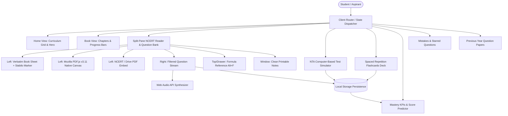

# PrepClone Technical Architecture Documentation

## 1. System Overview

PrepClone is engineered as a single-page application (SPA) adhering to the **Offline-First**, **Zero-Backend**, and **Local-First** architectural paradigms. It runs completely inside modern web standards (ES6+, CSS3 Custom Properties, Web Audio API, Canvas 2D, Service Workers, Cache Storage API, and Web Storage).



---

## 2. State Model & Navigation

Navigation is entirely hash-free and managed via `currentPage` variable and `navigate(page, args)`:
- `home`: Curriculum overview of all 10 books.
- `books`: Class (XI, XII) and Subject (Biology, Chemistry, Physics) filterable grid.
- `book`: Chapter listing with live progress bars and page completion stats.
- `chapter`: Core split-view textbook reader and page-by-page question solving.
- `mix-quiz`: NTA NEET/JEE exam simulator configuration and live test runner.
- `quiz`: Quick 10-question drill pool across all books.
- `flashcards`: SM-2 active recall deck.
- `analytics`: Performance statistics and NEET score prediction engine.
- `notebook`: Mistakes notebook and starred questions.
- `pyqs`: Official previous year exam links and statistics.

---

## 3. Storage Schemas (`localStorage`)

All user state is stored locally without remote tracking:

### 1. `prepclone-progress`
Stores user practice answers across chapters:
```typescript
interface ProgressStore {
  // Key format: `${bookId}_${chapterIndex}_${pageNumber}_${questionIndex}`
  [questionId: string]: {
    picked: number;        // Selected option index (0 = A, 1 = B, etc.)
    correct: boolean;      // Whether the chosen option matched answer
    timestamp: number;     // Milliseconds epoch
  }
}
```

### 2. `prepclone-mistakes`
Stores detailed records of questions answered incorrectly:
```typescript
interface MistakeRecord {
  id: string;              // e.g. "biology-11_0_1_2"
  question: string;        // Question text
  options: string[];       // 4 answer choices
  answer: string;          // Correct letter ('A' | 'B' | 'C' | 'D')
  picked: number;          // Student's chosen option index
  explanation: string;     // Conceptual NCERT explanation
  ncertRef: string;        // NCERT paragraph/page reference
  book: string;            // Book ID
  chapter: number;         // Chapter index
  timestamp: number;
}
type MistakesStore = Record<string, MistakeRecord>;
```

### 3. `prepclone-starred`
Stores question IDs bookmarked by the student:
```typescript
type StarredStore = string[]; // Array of question IDs
```

### 4. `prepclone-cbt-history`
Chronological log of completed NTA mock exam sessions:
```typescript
interface CbtSession {
  date: string;            // ISO date string
  preset: string;          // 'neet-full' | 'physics-drill' | etc.
  title: string;           // Display title
  score: number;           // Marks obtained
  totalMarks: number;      // Maximum marks
  percentage: number;      // Marks %
  timeSpentSecs: number;   // Duration in seconds
  sectionScores: Record<string, {
    attempted: number;
    correct: number;
    incorrect: number;
    score: number;
  }>;
}
type CbtHistoryStore = CbtSession[];
```

### 5. `prepclone-flashcards`
Tracks the SuperMemo SM-2 spaced repetition state for each flashcard:
```typescript
interface FlashcardState {
  repetitions: number;     // Number of successful consecutive recalls
  interval: number;        // Days until next review
  easeFactor: number;      // Difficulty multiplier (default 2.5)
  dueDate: number;         // Timestamp when card is due
}
type FlashcardsStore = Record<string, FlashcardState>;
```

### 6. User Preferences
- `theme`: `'dark'` | `'light'` | `'oled'` | `'sepia'`
- `prepclone-sound`: `'on'` | `'off'`
- `prepclone-leftpane-mode`: `'reader'` | `'canvas'` | `'pdf'`
- `prepclone-pdfmode`: `'0'` (Drive Embed) | `'1'` (Native NCERT) | `'2'` (Google Viewer)

---

## 4. Textbook Reader & Highlighting Subsystem

### Split View Engine
- `splitWrap.split-on`: Flexbox layout dividing viewport into 50% left pane (textbook) and 50% right pane (questions).
- Split toggle button allows expanding the question pane to 100% width (`split-off`).

### Sentence-Level Golden Stabilo Marker Pen
When a student clicks "Hint & NCERT Anchor" or "Highlight on Left Page":
1. **Target Identification**: Resolves `.ncert-para` element by ID `${bookId}_${chapterIdx}_${page}_${qIdx}`.
2. **Text Cache**: Caches `element.dataset.origText` to maintain verbatim text integrity without markup accumulation.
3. **Sentence Extraction**: Splits the textbook paragraph into individual sentences using regex punctuation boundaries `/[^.!?]+(?:[.!?]+["']?|$)/g`.
4. **Contextual Relevance Scoring**:
   $$\text{Score}(S) = 20 \cdot \mathbb{I}_{\text{OptionFragment} \in S} + 5 \sum_{w \in W_{\text{Ans}}} \mathbb{I}_{w \in S} + 2 \sum_{w \in W_{\text{Q}}} \mathbb{I}_{w \in S} + \sum_{w \in W_{\text{Exp}}} \mathbb{I}_{w \in S}$$
   where stop words are stripped and words are normalized.
5. **DOM Injection**: Wraps the winning sentence in `<mark class="ncert-sentence-marker sweep"><span class="marker-pen-icon">🖊️</span>${sentence}</mark>`.
6. **Audio Synthesis**: Calls `playTone('marker')` for felt-tip marker sweep sound.
7. **Smooth Centering**: Invokes `target.scrollIntoView({ behavior: 'smooth', block: 'center' })`.

### Native PDF.js v3.11 Canvas Layer
- Uses bundled `vendor/pdfjs/pdf.min.js` and `vendor/pdfjs/pdf.worker.min.js`.
- Renders PDF pages directly to an HTML5 `<canvas>` element at device pixel ratio.
- Overlays an absolute coordinate highlighter box (`.pdf-canvas-highlight-rect`) matching the page's vertical slice.

---

## 5. Web Audio API Sound Synthesis

Zero external audio assets or audio file requests. All sounds are synthesized client-side:
- **`click`**: High-frequency short sine beep (440 Hz, 50 ms).
- **`correct`**: Ascending two-tone triangle chord (523.25 Hz $\to$ 659.25 Hz, 220 ms).
- **`marker`**: Low-to-mid frequency smooth sine sweep (320 Hz $\to$ 540 Hz, 180 ms) simulating highlighter pen friction on paper.

---

## 6. Offline First & Service Worker Cache Lifecycle

`sw.js` implements a Stale-While-Revalidate and Cache-First dual strategy:
1. **Pre-Cached Static Assets**: `index.html`, `styles.css`, `manifest.json`, `vendor/pdfjs/*`, and `data/formulas.json`.
2. **Data & PDF Strategy**: `/data/*.json` and `/books/*.pdf` serve from cache first, with background network synchronization.
3. **Fallback**: Returns structured offline responses or cached fallbacks when network disconnects.
